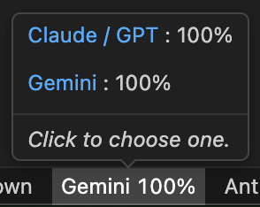

*다른 언어로 읽기: [한국어](README.md)*

# My Antigravity Usage (Antigravity Lite)

100% local and private. An ultra-lightweight **(~22 KB)** status bar extension that monitors your Antigravity AI model quota at a glance. No external network calls, no OAuth flows, no background processes.

  

## 📸 Preview

  

## ✨ Why My Antigravity Usage?

Antigravity already shows your quota in the settings panel, but it requires multiple clicks to access. This extension puts your AI quota **directly in your status bar**. Always visible, zero clicks required. 

- **Minimalism**: Instead of cluttered text and long model names, it displays only an intuitive icon and your remaining percentage in the status bar, keeping your workspace clean.
- **Clean Tooltip**: Hover to see a clean, beautifully categorized breakdown of "Gemini" and "Claude/GPT" quotas without any messy bullet points.

## 🔒 Privacy First (100% Local)

Everything runs **100% on your machine**. The extension reads quota data from the Antigravity process already running locally. No requests ever leave `localhost`.

- No internet requests, every call stays on `127.0.0.1`
- No Google authentication, no OAuth, no tokens stored
- No data sent to any server, your usage patterns stay completely private

## 🪶 Ultra-Lightweight (~22 KB)

Optimized with `esbuild`, the entire extension is packed into a tiny ~22 KB JavaScript bundle. 

- No bundled webviews, no CSS frameworks
- Activates in milliseconds
- Zero dependencies beyond the VS Code API

## ⚙️ Configuration

| Setting | Default | Description |
|---|---|---|
| `myAgyUsage.refreshInterval` | `120` | Refresh interval in seconds (10-3600) |

## ⌨️ Commands

| Command | Keybinding | Description |
|---|---|---|
| `Antigravity Lite: Refresh Quota Data` | `Ctrl/Cmd+Shift+R` | Refresh quota data immediately |

## 🚀 How to Install

1. Open VS Code (or Antigravity) and go to the Extensions view (`Ctrl+Shift+X`).
2. Search for **My Antigravity Usage**.
3. Click **Install**. That's it.

## 📄 License

[MIT License](LICENSE)
